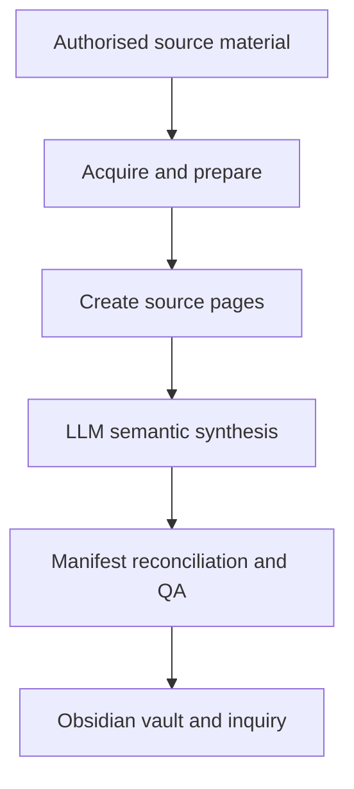

# Agentic Knowledge Vault Pipeline

An engineering-led, source-to-vault prototype for turning authorised material into a maintained Obsidian knowledge system.

## Runnable prototype

The repository now includes a sanitised, runnable starting point in [prototype/](prototype/):

- channel discovery with `yt-dlp`;
- manifest-backed incremental state;
- traceable source-note placeholders;
- clear synthesis hand-off state;
- deterministic reports; and
- safe report-only mode before any file changes.

It is based on a private, operating prototype, but contains no transcripts, creator-specific corpus, credentials, cookies, personal details, server addresses or production paths.

Start with [prototype/README.md](prototype/README.md).

## Proven private prototype

As at July 2026, the private prototype had:

- 295 catalogue items tracked by a manifest;
- zero missing clean transcripts;
- zero missing source pages;
- zero pending synthesis items; and
- successful incremental and zero-new-content runs.

These figures describe the private prototype. Its corpus and derived vault are not distributed here.

## Architecture

The design separates deterministic processing from semantic judgement and uses the manifest to prove every item has completed the required stages.

## Boundaries

This repository does not include:

- third-party transcripts or a derived public vault;
- credentials, cookies or production configuration;
- private VM access or deployment paths; or
- a scraper configured for an arbitrary third-party source.

Use only material you own, are licensed to process, or have permission to use.

See [architecture](docs/architecture.md), [results](docs/results-and-lessons.md), and [governance](docs/governance.md) for the project context.
