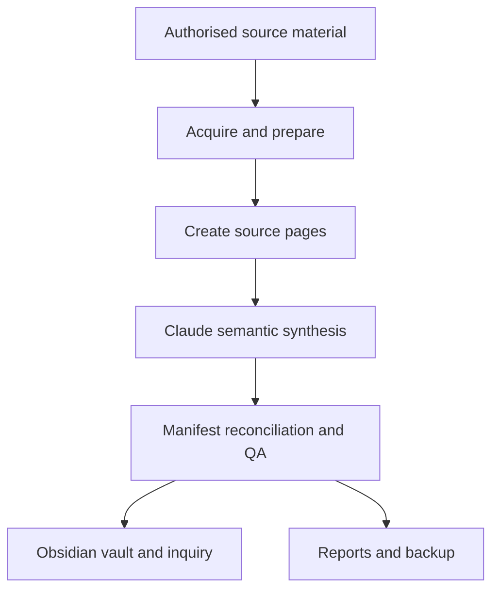

# Agentic Knowledge Vault Pipeline

An engineering-led prototype that turns a growing video catalogue into a maintained Obsidian knowledge system.

The project began with a use case associated with Andrej Karpathy: using Claude Code to synthesise source material into an Obsidian vault. Nate Herk demonstrated the idea to his community. I then extended the manual exercise into a remotely operated, incremental pipeline using Nate's published YouTube catalogue as the private test corpus.

The important result is not “295 transcripts in Obsidian”. It is a system that:

- separates predictable processing from AI judgement;
- processes only new or failed sources;
- preserves source lineage;
- checks whether every item completed each required stage;
- runs remotely on a weekly schedule; and
- turns a collection of individual videos into material that can be compared across the catalogue.

## Current verified state

As at July 2026, the private prototype had:

- 295 catalogue items tracked by a manifest;
- zero missing clean transcripts;
- zero missing source pages;
- zero pending synthesis items;
- successful incremental and zero-new-content runs; and
- recovery documentation, backups and run reporting.

These figures describe the private prototype. The Nate Herk transcript corpus and complete derived vault are not included in this repository.

## Architecture

The production prototype runs on an Ubuntu 24.04 ARM64 VM hosted on Oracle Cloud. Scripts handle scheduling, acquisition, transcript preparation, source-page creation, manifest state and QA. Claude Code is introduced only for work requiring semantic judgement: connecting concepts, updating synthesis pages and identifying recurring patterns.

See [Architecture and design decisions](docs/architecture.md) for more detail.

## Why this design matters

The pipeline operates like a small knowledge-processing plant:

- source material is the feed;
- deterministic stages prepare and route it;
- Claude performs the semantic transformation;
- the manifest tracks work-in-progress; and
- reconciliation checks that nothing has been lost between feed and finished output.

This is more than ordinary retrieval-augmented generation (RAG). RAG retrieves from a library. This system also builds, maintains, audits and updates the library.

## Two paths through this project

### Explore what the system does

Non-technical readers can start with:

- [What the prototype demonstrates](docs/results-and-lessons.md)
- [The flagship project post](docs/flagship-post.md)
- the forthcoming short demonstration and public sample vault

### Build your own

The intended public release will allow a user to provide source material they own, are licensed to use, or have permission to process. It is planned to include:

- source-agnostic ingestion;
- manifest and status tracking;
- deterministic preparation and source-page generation;
- synthesis prompts and agent instructions;
- reconciliation and QA;
- VM deployment and scheduling guidance;
- a small, lawfully distributable demonstration vault; and
- recovery and troubleshooting instructions.

The practical test for the reusable release is simple:

> Can a reasonably capable person supply authorised source material, follow the instructions, and produce a working wiki without private assistance?

That release is not yet complete. This repository currently documents the proven prototype, its design decisions and the work required to make it safely reproducible.

## Repository status

| Component | Status |
|---|---|
| Private Nate Herk prototype | Operating |
| Remote weekly schedule | Operating |
| Incremental processing | Verified |
| Failed-item retry | Verified |
| Manifest reconciliation | Verified |
| Zero-new-content exit | Verified |
| Public architecture and lessons | Available here |
| Sanitised reusable pipeline | In preparation |
| Authorised demo corpus and vault | Planned |
| One-command installation | Planned |

See the [public release roadmap](docs/roadmap.md).

## Source and governance boundary

The original experiment used a private research corpus derived from publicly available videos. Public availability does not automatically grant permission to redistribute complete transcripts or a derivative vault, and automated platform access can also be restricted by platform terms.

Accordingly, this repository does not include:

- Nate Herk's complete transcripts;
- the complete Nate-specific Obsidian vault;
- credentials, cookies or production configuration;
- access to the live VM; or
- a turnkey scraper configured for an arbitrary third-party channel.

The public implementation is being redesigned around user-owned, licensed or creator-authorised inputs. See [Source rights and responsible use](docs/governance.md).

## A finding from the private test corpus

Across the catalogue analysed, I observed an apparent progression from fixed n8n workflows, through AI-assisted automation, toward Claude Code, context engineering, reusable skills and more agentic systems.

My interpretation is that implementation is becoming easier while problem definition, context, controls and verification are becoming more valuable. This is my longitudinal analysis of the published catalogue—not a claim about Nate's intentions or future direction.

## Project lineage and contribution

- **Andrej Karpathy:** demonstrated the broader cognitive pattern of using Claude Code with an Obsidian knowledge base.
- **Nate Herk:** taught and demonstrated that use case to an automation-focused audience.
- **This project:** operationalised the pattern as a persistent remote system with scheduling, incremental updates, exception recovery, manifest control, QA, traceability and cross-catalogue synthesis.

## About the builder

I am a process and project engineer applying familiar engineering disciplines—defined inputs, controlled transformations, exception handling, verification and traceability—to AI-assisted systems.

## Feedback

The most useful feedback at this stage is:

- Which part would you want to use without building the system yourself?
- Which installation step would stop you from building your own?
- What evidence would you need before trusting a self-maintaining knowledge system?
