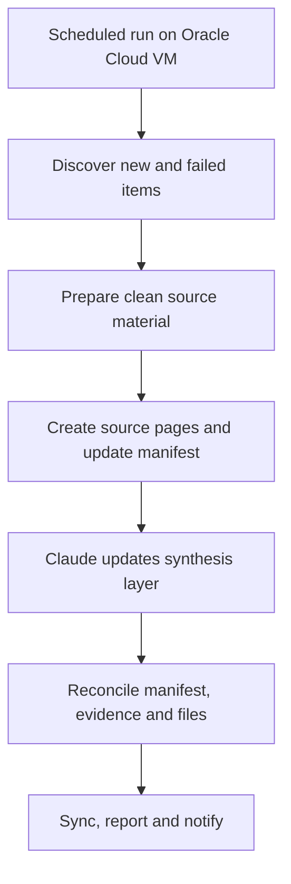

# Architecture and design decisions

## Operating flow

## The central design decision

Use AI only where meaning must be interpreted.

| Work | Method | Reason |
|---|---|---|
| Scheduling and discovery | Deterministic | The rules are known |
| Transcript preparation | Deterministic | Formatting cleanup is repeatable |
| Source-page creation | Deterministic | Structure and metadata are prescribed |
| Concept and pattern synthesis | Agentic | Requires semantic judgement |
| Manifest reconciliation | Deterministic | Completeness should be objectively testable |
| Review of important public claims | Human | Accountability remains with the publisher |

This reduces model usage, limits variability and makes failure states easier to diagnose.

## Persistent state

The manifest is the operating ledger. Each source progresses through explicit states rather than relying on the latest run report to determine whether work remains.

This matters because a zero-new-content scan can otherwise hide unfinished work from an earlier run. The prototype was repaired so pending synthesis is discovered from persistent manifest state and cannot be silently bypassed.

## Incremental operation

Each weekly run:

1. discovers genuinely new sources;
2. detects previously failed transcript rows;
3. prepares only the required items;
4. synthesises outstanding batches;
5. re-reads the manifest after synthesis;
6. refuses to report success while pending rows remain; and
7. exits cleanly when no new or pending work exists.

## Traceability

The system retains separate layers for:

- original source material;
- cleaned source text;
- per-source pages;
- cross-source synthesis;
- manifest state;
- run and QA reports; and
- recovery documentation and backups.

This separation allows a conclusion to be traced back toward its supporting sources and prevents generated synthesis from silently replacing the evidence layer.

## Private production details

The working prototype uses an Ubuntu 24.04 ARM64 VM hosted on Oracle Cloud, PowerShell, Bash, Claude Code, Obsidian and synchronised storage. Exact credentials, host details, cookies and production paths are intentionally excluded from the public project.
